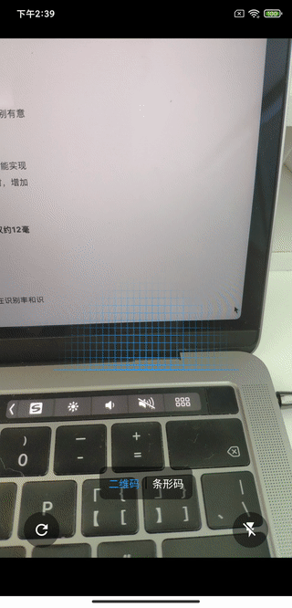
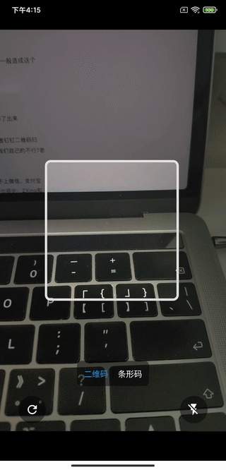

# r_barcode

## English

Flutter qr or barcode scan plugin(This plug-in is [r_scan](https://github.com/rhymelph/r_scan)  upgrade version.)

- [✔] Realization of camera scanning display based on texture
- [✔] Supported Android/IOS Platfrom
- [✔] Support to display the specific location of barcode / QR code
- [✔] Support to display the picture frame obtained by scanning successfully
- [✔] Switchable scan formats
- [✔] Flash can be turned on / off
- [✔] Support multiple barcode formats（Codabar,Code39,Code93,Code128,EAN8,ITF,UPCA,UPCE,Aztec,DataMatrix,PDF417,QRCode）
- [✔] Built in beautiful scanning frame (imitation Alipay scan box, Material Design style scan box), can be customized.
- [✔] Three states of scanning can be customized [scanning, loading and stop]

## 中文

该插件包是[r_scan](https://github.com/rhymelph/r_scan) 的升级版本

- [✔] 基于Texture实现相机扫描显示
- [✔] 支持Android/IOS平台
- [✔] 支持显示条形码/二维码具体位置
- [✔] 支持显示扫描成功得到的图片帧
- [✔] 可切换支持的扫描类型
- [✔] 可打开/关闭闪光灯
- [✔] 支持多种条形码格式（Codabar,Code39,Code93,Code128,EAN8,ITF,UPCA,UPCE,Aztec,DataMatrix,PDF417,QRCode）
- [✔] 内置精美的扫描框（仿支付宝扫描框，Material Design风格扫描框）,可自行定制
- [✔] 可定制扫描的三种状态【扫描中、加载中、停止】

|  <b>扫描二维码</b> |  <b>扫描条形码</b> |  <b>Material风格</b> | 
| :---: | :---: | :---: |
